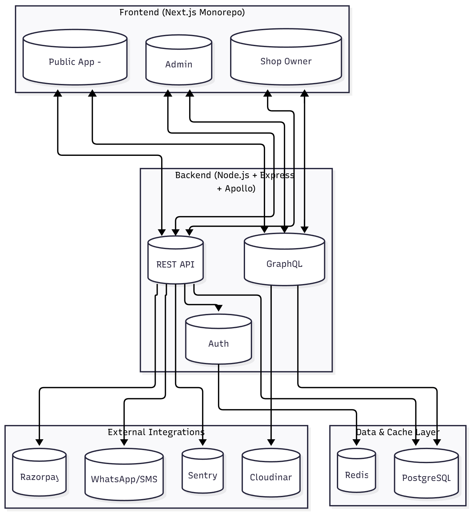

# 🏪 Localo

**One place for all your local needs — shops, restaurants, groceries, and more.**

---

## 🧭 Overview

**Localo** is a unified local marketplace platform connecting customers with nearby shops across various categories — groceries, restaurants, sports, stationery, fashion, and more.

It brings all local stores under one roof, enabling customers to discover and shop conveniently while empowering shop owners to manage their products, advertise, and grow digitally.

---

## 👥 User Types

### 🧍 Guest
- Browse shops and products
- Search by shop or product
- Add to cart (temporary)
- Must log in to checkout

### 👤 Registered User (Customer)
- Browse and shop across categories  
- Add to cart and place orders (COD or online)  
- Manage profile and order history  
- Receive notifications (Email, SMS, WhatsApp)

### 🛍️ Shop Owner
- Manage shop via dashboard  
- Add/Edit/Delete products  
- View analytics and performance charts  
- Run ads for shop or products  
- Manage shop profile and orders

### 🧑‍💼 Admin
- Platform-level access  
- Manage users, shops, and products  
- Approve/deactivate shops  
- View reports and analytics  
- Manage ads and logs

---

## 🧠 Tech Stack

| Layer | Technology |
|-------|-------------|
| **Frontend** | Next.js (App Router) |
| **State Management** | Zustand |
| **Styling** | Tailwind CSS |
| **Theme** | next-themes (Dark/Light) |
| **Backend** | Node.js + Express.js |
| **Database** | PostgreSQL |
| **ORM / Query Layer** | Prisma |
| **API Architecture** | REST + GraphQL (Hybrid) |
| **Caching** | Redis |
| **Payment Gateway** | Razorpay |
| **Media Storage** | Cloudinary |
| **Notifications** | WhatsApp, SMS, Email |
| **Deployment** | Vercel (Frontend) + Railway (Backend) |
| **Version Control** | Monorepo |
| PWA (Progressive Web App) for mobile and web support which Enables offline access, installable app experience, and push notifications

---

## 🧱 Architecture Overview

Localo follows a **monorepo structure** where customer, shop owner, and admin apps coexist under one unified project.

```bash
/apps
 ├── (public)/        → Landing, Product, Shop, Cart, Checkout
 ├── (shop)/          → Shop Owner Dashboard
 └── (admin)/         → Admin Panel
/common               → Shared components, hooks, utils
/lib                  → Services, API clients, constants

Auth Strategy:
- Tokens stored in HttpOnly cookies
- Guest session tracked by Redis (expires in X mins)
- Refresh token rotation every X days

Architecture Decision:
- Initial version: unified backend (Express + Apollo Server)
- Later: evolve to microservices (Auth, Product, Order)
- Use NGINX / Next.js middleware for role-based proxying

Observability:
- Winston or Pino for structured logs
- Request tracing with Morgan
- Error tracking with Sentry
- Monitoring dashboard via Railway metrics or Grafana (later phase)

File Upload Flow:
- Client uploads via backend-signed URL (secure)
- Validation: < 5MB, JPEG/PNG only
- Stored in Cloudinary under `/shops/{shopId}/products/`

Search Implementation:
- PostgreSQL full-text search for products & shops
- Filters by category, price range, and availability
- Redis caching for frequent queries

Order States:
- pending → paid → shipped → delivered → completed
- Cancelled/refunded handled via Razorpay webhooks

